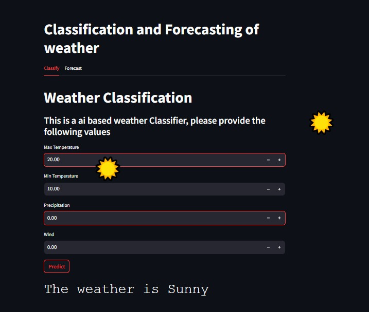
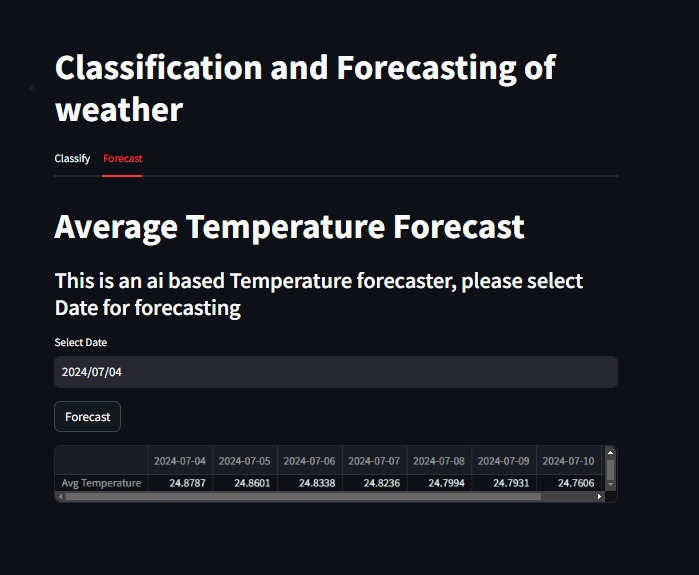

# Classification and Forecasting of Weather Data

## Classification:
Used different classification algorithms to classify weather data based on four parameters: precipitation, max temperature, min temperature, and wind speed. The models were trained on the Seattle weather dataset.

## Forecasting: 
Used Neural Prophet for forecasting weather data. The model was trained on data collected from HAL in Bengaluru in 1950.

All datasets and models can be found in the respective repositories.


## Features

- Weather Classification

    - Utilizes historical weather data to classify current weather conditions.
    - Achieves approximately 85% accuracy.
    - Based on the Seattle weather dataset from Kaggle.

- Weather Forecasting

    - Predicts future weather patterns based on past weather data.
    - Achieves approximately 80% accuracy.
    - Utilizes the Neural Prophet model.
    - Based on weather data from HAL Bangalore.

## Technologies Used

- Python
- NumPy
- Pandas
- Sci-kit Learn
- Neural Prophet
- Streamlit

## Installation

Follow these steps to install and run the project:

1. **Clone the repository:**
   ```bash
   git clone https://github.com/Zzabi/skysight.git
   cd skysight
   ```
2. **Create and activate virtual environment:**
   ```bash
   conda create -n sky python=3.10.0
   conda activate sky
   ```
3. **Install the required dependencies:**
   ```bash
   pip install requirements.txt
   ```
4. Refer to [Weather_prediction.ipynb](classification/Weather_Prediction.ipynb) and [Neural Prophet.ipynb](forecasting/Neural%20Prophet.ipynb) file to see dataset preparation using roboflow and training using YOLOv5

## Usage

1. **Run the prediction script:**
   ```bash
   streamilt run main.py
   ```

### or you can directly click [here](https://skysight.streamlit.app) 

## Screenshots

Here are some examples of the model in action:





